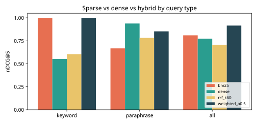
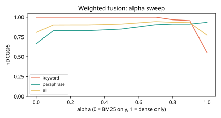

# Results -- ai-learn-16-hybrid-search-bm25

**Seed:** `42` | docs=30 | queries=28 (12 keyword, 16 paraphrase) | BM25 k1=1.5 b=0.75 | dense LSA dim=24 (background explained var 0.801, doc-token OOV 0.54) | RRF depth=10

## all queries (real smoke run)

| method | recall@1 | recall@3 | recall@5 | mrr@10 | ndcg@5 |
|---|---:|---:|---:|---:|---:|
| `bm25` | 0.696 | 0.786 | 0.804 | 0.833 | 0.810 |
| `dense` | 0.589 | 0.839 | 0.839 | 0.756 | 0.773 |
| `rrf_k60` | 0.482 | 0.786 | 0.786 | 0.705 | 0.706 |
| `weighted_a0.5` | 0.768 | 0.946 | 0.946 | 0.917 | 0.916 |

## keyword queries (real smoke run)

| method | recall@1 | recall@3 | recall@5 | mrr@10 | ndcg@5 |
|---|---:|---:|---:|---:|---:|
| `bm25` | 1.000 | 1.000 | 1.000 | 1.000 | 1.000 |
| `dense` | 0.417 | 0.667 | 0.667 | 0.514 | 0.553 |
| `rrf_k60` | 0.500 | 0.667 | 0.667 | 0.618 | 0.605 |
| `weighted_a0.5` | 1.000 | 1.000 | 1.000 | 1.000 | 1.000 |

## paraphrase queries (real smoke run)

| method | recall@1 | recall@3 | recall@5 | mrr@10 | ndcg@5 |
|---|---:|---:|---:|---:|---:|
| `bm25` | 0.469 | 0.625 | 0.656 | 0.709 | 0.668 |
| `dense` | 0.719 | 0.969 | 0.969 | 0.938 | 0.939 |
| `rrf_k60` | 0.469 | 0.875 | 0.875 | 0.771 | 0.782 |
| `weighted_a0.5` | 0.594 | 0.906 | 0.906 | 0.854 | 0.853 |

## Fusion sweeps (nDCG@5)

| weighted alpha | keyword | paraphrase | all |
|---:|---:|---:|---:|
| 0.0 | 1.000 | 0.668 | 0.810 |
| 0.1 | 1.000 | 0.832 | 0.904 |
| 0.2 | 1.000 | 0.833 | 0.904 |
| 0.3 | 1.000 | 0.833 | 0.904 |
| 0.4 | 1.000 | 0.842 | 0.910 |
| 0.5 | 1.000 | 0.853 | 0.916 |
| 0.6 | 1.000 | 0.880 | 0.931 |
| 0.7 | 1.000 | 0.907 | 0.947 |
| 0.8 | 0.969 | 0.915 | 0.939 |
| 0.9 | 0.958 | 0.915 | 0.934 |
| 1.0 | 0.553 | 0.939 | 0.773 |

Best alpha on this eval set: **0.7** (all nDCG@5 0.947). It was tuned on the same 28 queries, so treat it as optimistic.

| RRF k | keyword | paraphrase | all |
|---:|---:|---:|---:|
| 1 | 0.772 | 0.821 | 0.800 |
| 10 | 0.605 | 0.790 | 0.711 |
| 60 | 0.605 | 0.782 | 0.706 |

## Per-query top-3 (weighted fusion vs BM25 vs dense)

| id | type | relevant | BM25 top-3 | dense top-3 | weighted top-3 |
|---|---|---|---|---|---|
| q01 | keyword | d02:2 | d02 d01 d03 | d01 d02 d03 | d02 d01 d03 |
| q02 | keyword | d03:2 | d03 d01 d02 | d01 d02 d03 | d03 d01 d02 |
| q03 | keyword | d04:2 | d04 d01 d02 | d04 d14 d17 | d04 d14 d17 |
| q04 | keyword | d07:2 | d07 d01 d02 | d07 d25 d21 | d07 d25 d21 |
| q05 | keyword | d13:2 | d13 d01 d02 | d13 d29 d15 | d13 d29 d15 |
| q06 | keyword | d14:2 | d14 d01 d02 | d14 d27 d18 | d14 d27 d18 |
| q07 | keyword | d15:2 | d15 d01 d02 | d01 d02 d03 | d15 d01 d02 |
| q08 | keyword | d16:2 | d16 d01 d02 | d01 d02 d03 | d16 d01 d02 |
| q09 | keyword | d21:2 | d21 d07 d27 | d21 d07 d06 | d21 d07 d06 |
| q10 | keyword | d25:2 | d25 d03 d01 | d16 d03 d25 | d25 d03 d16 |
| q11 | keyword | d22:2 | d22 d12 d01 | d01 d02 d03 | d22 d12 d01 |
| q12 | keyword | d24:2 | d24 d01 d02 | d01 d02 d03 | d24 d01 d02 |
| q13 | paraphrase | d01:2 d09:1 | d01 d02 d03 | d01 d17 d02 | d01 d17 d02 |
| q14 | paraphrase | d06:2 d05:1 | d06 d02 d01 | d06 d26 d05 | d06 d26 d05 |
| q15 | paraphrase | d03:2 d16:1 | d03 d25 d12 | d03 d16 d25 | d03 d16 d25 |
| q16 | paraphrase | d08:2 | d01 d02 d03 | d08 d22 d09 | d08 d22 d09 |
| q17 | paraphrase | d07:2 | d25 d28 d01 | d07 d25 d28 | d25 d07 d28 |
| q18 | paraphrase | d10:2 | d01 d02 d03 | d10 d18 d17 | d10 d18 d17 |
| q19 | paraphrase | d12:2 | d29 d12 d01 | d29 d12 d23 | d29 d12 d23 |
| q20 | paraphrase | d15:2 d23:1 | d15 d18 d03 | d15 d10 d23 | d15 d10 d23 |
| q21 | paraphrase | d28:2 | d28 d01 d02 | d28 d01 d17 | d28 d01 d17 |
| q22 | paraphrase | d17:2 | d05 d17 d01 | d17 d05 d20 | d05 d17 d20 |
| q23 | paraphrase | d26:2 d06:1 | d26 d06 d02 | d26 d06 d20 | d26 d06 d02 |
| q24 | paraphrase | d23:2 | d16 d24 d03 | d15 d23 d24 | d15 d24 d16 |
| q25 | paraphrase | d19:2 | d19 d01 d04 | d19 d01 d22 | d19 d01 d04 |
| q26 | paraphrase | d14:2 | d14 d01 d02 | d14 d08 d13 | d14 d08 d13 |
| q27 | paraphrase | d09:2 | d09 d13 d01 | d09 d13 d08 | d09 d13 d08 |
| q28 | paraphrase | d29:2 | d29 d11 d12 | d29 d12 d13 | d29 d12 d11 |

## Plots

Wall time: 0.032s on CPU.
